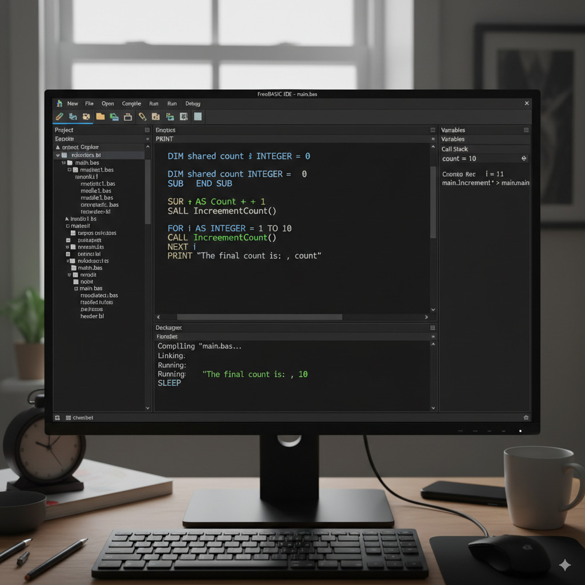

________________

**IDEFreeBASIC Desktop and Development Files - Project: kofabgap**

This repository contains the necessary files and an integrated development environment (IDE) setup for developing desktop applications using the FreeBASIC language. The project name associated with this setup is "kofabgap".

**1. FreeBASIC Language**

FreeBASIC is a free/open source (GPL) BASIC compiler for Microsoft Windows, DOS, Linux and BSD. It is capable of compiling a wide range of BASIC programs, from legacy GW-BASIC applications to modern, object-oriented GUI programs.

**2. Repository Contents**

This repository is structured to provide a complete development environment. It includes:

*   **`./kofabgap/`**: This directory holds the core project files for "kofabgap". You'll find your FreeBASIC source code (`.bas`), resource files, and potentially compiled executables here.
*   **IDE Configuration Files**: Specific configuration files for an IDE that enhances FreeBASIC development. This might include project settings, syntax highlighting rules, build commands, and debugging configurations.
*   **Documentation**: Any specific documentation related to the "kofabgap" project or the IDE setup.

**3. Setting Up Your Development Environment**

To get started with developing "kofabgap" using FreeBASIC and the provided IDE, follow these steps:

*   **Clone the Repository**: If you haven't already, clone this repository to your local machine.

    ```bash
    git clone [repository_url]
    ```

*   **Install FreeBASIC Compiler**: Ensure you have the FreeBASIC compiler installed on your system. You can download it from the official FreeBASIC website: [http://www.freebasic.net/](http://www.freebasic.net/)

*   **Configure the IDE**:
    *   Identify the IDE you'll be using. (e.g., FBEdit, Geany, Visual Studio Code with FreeBASIC extensions, etc.)
    *   Import the provided IDE configuration files. The exact steps will depend on the IDE. Look for files like `.fbp` (FreeBASIC Project), `.project` (Geany), or `.vscode/` (VS Code).
    *   Verify that the IDE is correctly pointing to your FreeBASIC compiler installation.

*   **Open the Project**: Open the "kofabgap" project within your configured IDE.

**4. Building and Running "kofabgap"**

Once your environment is set up:

*   **Build**: Use the IDE's build command (usually F9 or a "Build Project" option) to compile your FreeBASIC source code into an executable.

    ```bash
    fbc -s gui "./kofabgap/main.bas"
    ```
    (Note: Replace `main.bas` with your actual main FreeBASIC source file if it's different.)

*   **Run**: After a successful build, use the IDE's run command (usually F5 or a "Run Project" option) to execute the compiled application.

**5. Project Structure Example for "kofabgap"**

A typical structure within the `./kofabgap/` directory might look like this:

```
./kofabgap/
├── main.bas           (Main FreeBASIC source file)
├── module1.bas        (Another FreeBASIC source module)
├── resources/         (Directory for images, icons, sounds, etc.)
│   ├── icon.ico
│   └── background.bmp
├── includes/          (Directory for FreeBASIC include files - .bi)
│   └── mylibrary.bi
├── build/             (Directory for compiled output - .exe, .o)
│   └── kofabgap.exe
└── kofabgap.fbp       (FreeBASIC Project file for FBEdit or similar IDEs)
```
**6. IDE Screenshot Example**

Here's an example of what a FreeBASIC IDE might look like while working on a project:
 
This image shows a typical IDE setup for FreeBASIC, with code on the left, project files on the right, and output/debug windows at the bottom.

**7. Contributing**

If you wish to contribute to the "kofabgap" project or improve this development environment setup, please refer to the project's specific contribution guidelines (if any).

**8. License**

(Add licensing information here, e.g., MIT, GPL, etc.)

---

**Note to maintainers**: Please ensure all paths and commands are accurate for the specific IDE and project setup intended for "kofabgap".