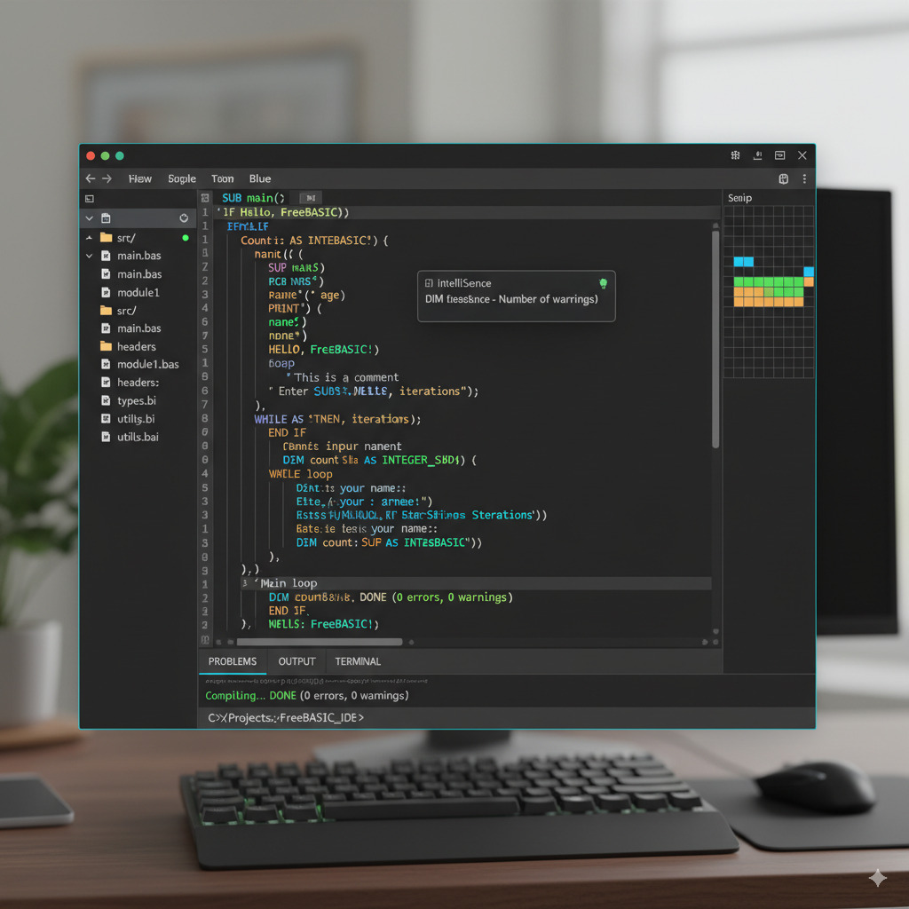

_____________

FreeBASIC is a powerful, open-source, 32-bit BASIC compiler, but it doesn't come with its own integrated development environment (IDE). This means users often rely on third-party editors or configure existing ones to work with FreeBASIC. Here are some thoughts and ideas on what makes a good FreeBASIC editor, along with some popular choices:

### Key Features for a FreeBASIC Editor:

1.  **Syntax Highlighting:** This is fundamental. It makes code much more readable by coloring different elements (keywords, strings, comments, numbers, etc.).
2.  **Code Completion (IntelliSense):** This is a huge time-saver. As you type, the editor suggests FreeBASIC keywords, functions, and variables, reducing typos and speeding up development.
3.  **Code Folding/Outlining:** Allows you to collapse and expand blocks of code (functions, loops, conditional statements) to get a better overview of your program.
4.  **Integrated Compiler/Debugger Support:**
    *   **Compile:** A one-click or hotkey command to compile the current FreeBASIC source file.
    *   **Run:** Execute the compiled program directly from the editor.
    *   **Debugger:** Integration with a debugger (like GDB) to set breakpoints, step through code, inspect variables, and trace execution. This is often the trickiest part to set up.
5.  **Project Management:** For larger applications, the ability to group multiple source files, headers, and resources into a project.
6.  **Find and Replace (with Regular Expressions):** Essential for refactoring and making widespread changes.
7.  **Customizable Interface:** Themes, font choices, and configurable layouts.
8.  **Context-Sensitive Help:** Ideally, being able to select a FreeBASIC keyword or function and press a key to jump to its documentation.
9.  **Multi-Platform Support:** Since FreeBASIC compiles for Windows, Linux, and DOS, an editor that works across these platforms can be beneficial.
10. **Portability:** For some users, an editor that can be run from a USB drive without installation is a plus.

### Popular Choices and Their Strengths:

*   **FBEdit:** This is probably the most commonly recommended and purpose-built IDE for FreeBASIC on Windows.
    *   **Strengths:** Designed specifically for FreeBASIC, good syntax highlighting, code completion, direct compilation and execution. It's often the easiest to get started with.
    *   **Weaknesses:** Windows-only, interface might feel a bit dated to some, debugging integration can sometimes require extra setup.

*   **Geany:** A lightweight, cross-platform IDE that works very well with FreeBASIC.
    *   **Strengths:** Fast, customizable, good syntax highlighting, robust build system integration (easy to configure compile/run commands for FreeBASIC). Available on Linux, Windows, macOS.
    *   **Weaknesses:** Code completion isn't FreeBASIC-specific out-of-the-box (though it can be configured), debugging usually requires an external GDB setup.

*   **Code::Blocks:** A more full-featured, cross-platform IDE.
    *   **Strengths:** Powerful project management, excellent debugger integration (GDB), customizable. Can be configured for FreeBASIC.
    *   **Weaknesses:** Can be a bit heavy for simple projects, setup for FreeBASIC requires manual compiler configuration.

*   **Visual Studio Code (VS Code):** A very popular, modern, and highly extensible code editor.
    *   **Strengths:** Extremely customizable with extensions, excellent syntax highlighting (there are FreeBASIC extensions), integrated terminal, strong community support. Cross-platform.
    *   **Weaknesses:** No built-in FreeBASIC compiler/debugger integration. You'll need to configure build tasks and potentially a debugger extension (like C/C++ tools for GDB) to work with FreeBASIC. This requires some command-line knowledge.

*   **Notepad++ (Windows) / Scintilla-based editors:**
    *   **Strengths:** Lightweight, fast, excellent syntax highlighting (customizable, including for FreeBASIC), good search/replace. Can be configured with "Run" commands to compile and execute FreeBASIC.
    *   **Weaknesses:** Not a full IDE, no inherent code completion or debugger integration. Best for smaller scripts or as a text editor companion.

### Ideas for an "Ideal" FreeBASIC Editor/IDE:

If one were to design a perfect FreeBASIC editor, beyond the core features, here are some "idea" enhancements:

1.  **Visual Form Designer:** For creating GUI applications with FreeBASIC (e.g., with WinAPI or FBGUI), a drag-and-drop form designer would be invaluable, similar to Visual Basic 6 or Lazarus/Delphi.
2.  **Built-in Resource Editor:** For managing icons, cursors, string tables, etc., especially for Windows applications.
3.  **Integrated Help Browser:** A dedicated panel or window that displays FreeBASIC documentation, automatically jumping to relevant sections based on the keyword under the cursor.
4.  **Template Engine:** Pre-built project templates for console apps, GUI apps, DLLs, etc., to get started quickly.
5.  **Package Manager Integration:** If FreeBASIC ever gets a robust package management system for libraries, the IDE should integrate with it.
6.  **Version Control Integration:** Seamless integration with Git, SVN, or other VCS.
7.  **Cross-Compiler Support:** Easy switching between target platforms (Windows, Linux, DOS) and architectures (32-bit, 64-bit) within the IDE.
8.  **Modern UI/UX:** A clean, responsive, and customizable interface that aligns with modern development tools.

Ultimately, the best FreeBASIC editor depends on individual preferences and the complexity of the projects you're working on. For beginners, FBEdit is a great starting point. For more experienced users or those needing cross-platform support, Geany or VS Code with proper configuration are excellent choices.

Let me know if you'd like a more detailed look into configuring a specific editor for FreeBASIC! 

Here is an image depicting a generic modern code editor with FreeBASIC syntax highlighting, showing some example FreeBASIC code. 